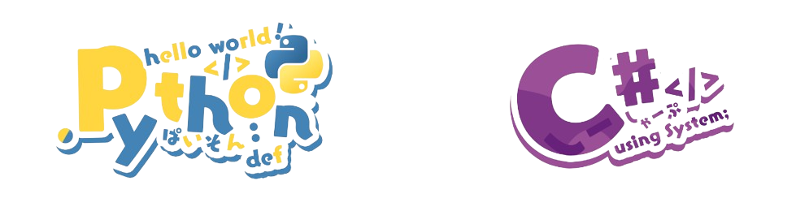

I don't usually upload my projects here, but I will upload all of them in the future. :D
### Hi there 👋
<h1 align="center">Hi 👋, I'm HatakaCder</h1>

<ul>
  <li>My full name is Viet Quoc Pham.</li>
  <li>Currently a final-year Bachelor of Computer Science student at the University of Information Technology - VNUHCM.</li>
  <li>First language: Vietnamese</li>
  <li>Second language: English - US</li>
  <li>Foreign language: Japanese</li>
</ul>

- 📫 How to reach me **phamviet26100@gmail.com**

<h3 align="left">Connect with me:</h3>

<h3 align="left">Proficient Languages:</h3>
</img>

- Python: Natural Language Processing, Machine Learning, Data Mining, Web Development

- C#: Software Development 

<h3 align="left">Knowledgeable Languages and Tools:</h3>

  
  
  
  
  
  
  
  
  
  
  
  
  
  
  
  
  
  
  
  
  
  
  
  
  
  
  

<!--
**HatakaCder/HatakaCder** is a ✨ _special_ ✨ repository because its `README.md` (this file) appears on your GitHub profile.

Here are some ideas to get you started:

- 🔭 I’m currently working on ...
- 🌱 I’m currently learning ...
- 👯 I’m looking to collaborate on ...
- 🤔 I’m looking for help with ...
- 💬 Ask me about ...
- 📫 How to reach me: ...
- 😄 Pronouns: ...
- ⚡ Fun fact: ...
-->
